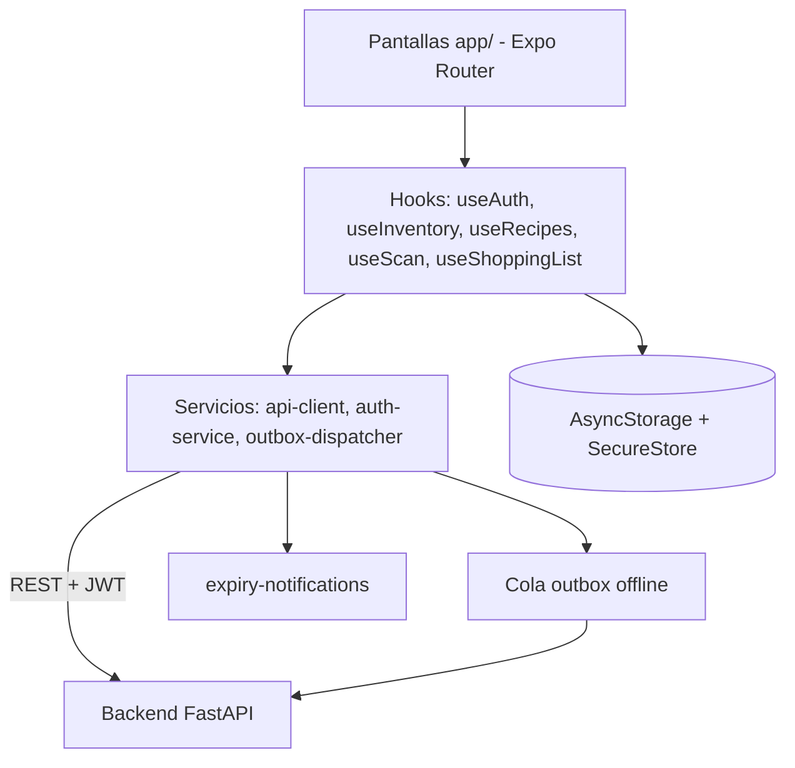

<div align="center">


# Food AI — App móvil

**Escanea tu despensa, controla los vencimientos y cocina con ayuda de IA.**


</div>

---

## Tabla de contenido

- [Acerca del proyecto](#acerca-del-proyecto)
- [Características principales](#características-principales)
- [Stack tecnológico](#stack-tecnológico)
- [Arquitectura y cómo funciona](#arquitectura-y-cómo-funciona)
- [Relación con el backend](#relación-con-el-backend)
- [Instalación y ejecución](#instalación-y-ejecución)
- [Estructura de carpetas](#estructura-de-carpetas)
- [Cómo contribuir](#cómo-contribuir)
- [Licencia](#licencia)

## Acerca del proyecto

**Food AI** es una aplicación móvil que ayuda a las personas a llevar el control de lo que tienen en casa. Fotografías tu nevera o despensa, la IA reconoce los alimentos, y la app te avisa de los próximos vencimientos y te sugiere recetas con lo que ya tienes, reduciendo el desperdicio de comida y el tiempo de planificar qué cocinar.

Está dirigida a usuarios finales que quieren organizar su despensa, su lista de compras y sus recetas desde el teléfono. Funciona con el backend [backend-mobile](https://github.com/StehvenObandoUcc/backend-mobile).

## Características principales

- **Escaneo con cámara o galería**: detecta ingredientes (nombre, categoría, cantidad, unidad y confianza) y permite confirmarlos o corregirlos antes de guardarlos.
- **Inventario de despensa**: alta, edición y borrado, con fechas de vencimiento y estado de salud de la despensa.
- **Avisos de vencimiento**: notificaciones locales programadas.
- **Recetas con IA («Chef IA»)**: generación según ingredientes, dificultad, enfoque, tiempo, porciones, preferencias dietarias e ingredientes a evitar; detalle con pasos y guardado de favoritas.
- **Lista de compras**: gestión de ítems y paso de comprados al inventario.
- **Modo offline con sincronización**: persistencia local y cola de mutaciones (outbox) con reintentos e idempotencia.
- **Cuenta de usuario**: registro, inicio de sesión, perfil y foto de perfil; sesión guardada de forma segura en el dispositivo.
- **Sistema de diseño propio**: tokens de tema, tipografía Outfit y catálogo de componentes (`design-catalog`).
- **Textos legales** dentro de la app.

## Stack tecnológico

| Componente | Tecnología | Versión |
|---|---|---|
| Framework | Expo | ~57.0.26 |
| Runtime | React Native | 0.86.3 |
| UI | React | 19.2.3 |
| Lenguaje | TypeScript | ~6.0.3 |
| Navegación | Expo Router | ~57.0.24 |
| Cámara / imágenes | expo-camera, expo-image-picker, expo-image-manipulator | ~57.0.x |
| Notificaciones | expo-notifications | ~57.0.21 |
| Almacenamiento local | @react-native-async-storage/async-storage | ^2.2.0 |
| Almacenamiento seguro | expo-secure-store | ~57.0.4 |
| Compilación | EAS Build (perfiles `development`, `preview`, `production`) | CLI ≥ 12.0.0 |
| Pruebas | Node test runner (`node --test`) | — |

## Arquitectura y cómo funciona



- **`app/`**: pantallas y rutas (file-based routing). El layout raíz redirige a `/login` si no hay sesión.
- **`src/hooks/`**: estado y lógica de cada dominio.
- **`src/services/`**: comunicación con la API, autenticación, notificaciones y sincronización.
- **`src/storage/`**: persistencia local con claves versionadas.
- **`src/components/` y `src/theme/`**: sistema de diseño.

**Flujo de punta a punta: escanear y guardar ingredientes**

1. En `app/scan.tsx` el usuario toma o elige una foto.
2. `useScan` → `scan-service` → `scanImageWithApi` envía la imagen en base64 a `POST /api/v1/scan` con el token Bearer.
3. El backend analiza la imagen con IA y devuelve los ingredientes detectados.
4. `app/scan-result.tsx` muestra los resultados para confirmarlos o editarlos.
5. Al guardar, el inventario se actualiza localmente de inmediato y la mutación se envía a `POST /api/v1/inventory`; si no hay red, queda en la cola outbox y se reintenta después. El backend la persiste en su base de datos.

## Relación con el backend

Esta app consume **[backend-mobile](https://github.com/StehvenObandoUcc/backend-mobile)** (FastAPI).

- **Protocolo:** REST sobre HTTP(S), prefijo `/api/v1`; datos en JSON.
- **Autenticación:** `Authorization: Bearer <token>` (JWT obtenido en login/registro); el token se registra en el cliente mediante `registerAuthTokenProvider`.
- **Cliente:** `src/services/api-client.ts`.
- **Resolución de la URL base** (en orden de prioridad): variable pública `EXPO_PUBLIC_API_URL`; IP del host de desarrollo detectada por Expo; `10.0.2.2:8000` en emulador Android; `localhost:8000` en iOS Simulator/Web.

| Funcionalidad | Endpoints usados |
|---|---|
| Autenticación | `/auth/register`, `/auth/login`, `/auth/me` |
| Escaneo | `POST /scan` |
| Inventario | `/inventory` (GET, POST, PUT, DELETE) |
| Lista de compras | `/shopping` (GET, POST, PUT, DELETE) |
| Recetas | `/recipes`, `/recipes/steps`, `/recipes/saved`, `/recipes/save` |

## Instalación y ejecución

### Requisitos

- Node.js y npm (versión mínima: **Por confirmar**).
- Un archivo de entorno propio si necesitas apuntar a un backend concreto (no se incluye ni documenta en este repositorio).
- Backend en ejecución: consulta [backend-mobile](https://github.com/StehvenObandoUcc/backend-mobile).
- Para dispositivos físicos: Expo Go o un *development build*; para emulador: Android Studio.

### Pasos

```bash
# 1. Clonar el repositorio
git clone https://github.com/StehvenObandoUcc/App-mobile-front.git
cd App-mobile-front

# 2. Instalar dependencias
npm install

# 3. Iniciar el servidor de desarrollo
npm start

# 4. (Opcional) Abrir directamente en Android
npm run android
```

### Pruebas

```bash
npm test
```

### Generar un APK

Con [EAS CLI](https://docs.expo.dev/eas/) y sesión iniciada:

```bash
eas build --platform android --profile preview
```

Los perfiles `preview` y `production` generan un APK (`eas.json`).

## Estructura de carpetas

```
.
├── app/                   # Pantallas (Expo Router)
│   ├── _layout.tsx        # Layout raíz, splash, fuentes y guardia de sesión
│   ├── login.tsx          # Bienvenida / acceso
│   ├── index.tsx          # Inicio
│   ├── scan.tsx           # Captura de foto
│   ├── scan-result.tsx    # Resultados del escaneo
│   ├── inventory.tsx      # Despensa
│   ├── recipes.tsx        # Recetas
│   ├── recipe-detail.tsx  # Detalle de receta
│   ├── shopping-list.tsx  # Lista de compras
│   ├── profile.tsx        # Perfil
│   ├── settings.tsx       # Ajustes
│   ├── legal.tsx          # Textos legales
│   └── design-catalog.tsx # Catálogo del sistema de diseño
├── assets/                # Íconos, splash, logo y fuentes
├── src/
│   ├── components/        # Componentes reutilizables de UI
│   ├── content/           # Contenido estático (textos legales)
│   ├── hooks/             # Hooks de dominio
│   ├── services/          # API, autenticación, notificaciones y outbox
│   ├── storage/           # Persistencia local
│   ├── theme/             # Colores, tipografía, espaciado, radios y elevaciones
│   ├── types/             # Tipos de TypeScript
│   └── utils/             # Utilidades (fechas, unidades, vencimientos, validaciones)
├── tests/                 # Pruebas (consumo, fechas, recordatorios, sincronización offline)
├── app.json               # Configuración de Expo
├── eas.json               # Perfiles de EAS Build
└── package.json
```

## Cómo contribuir

1. Haz un fork y crea una rama descriptiva: `git checkout -b feat/mi-cambio`.
2. Mantén el estilo existente (TypeScript, componentes y tokens del tema) y ejecuta `npm test`.
3. Usa mensajes de commit claros (por ejemplo, [Conventional Commits](https://www.conventionalcommits.org/es/)).
4. Abre un Pull Request describiendo qué cambia y por qué; si afecta la interfaz, adjunta capturas.
5. Nunca incluyas claves, tokens ni archivos `.env` en tus commits.

## Licencia

Por confirmar. El repositorio no incluye un archivo de licencia. La fuente Outfit incluida en `assets/fonts` se distribuye bajo SIL Open Font License (`OFL.txt`).
